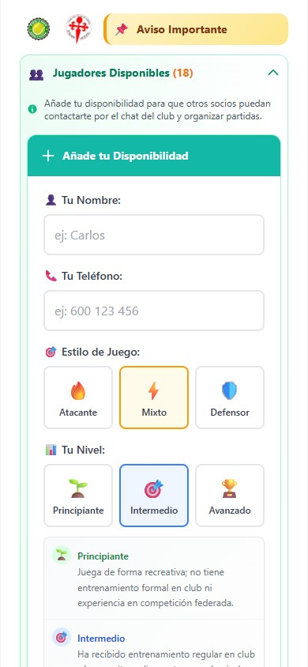

# 🏓 Table Tennis Reservation App — One Place to Book Tables and Join Events

> **End daily chaos.** One platform for bookings, events, and player coordination — no more WhatsApp threads or spreadsheet disasters.

<p align="center">

  
  
  
</p>

---

## 🚨 The Problem

- 📵 Members book tables over WhatsApp — overbookings only surface when someone shows up
- 🕐 Coordinators spend hours a week answering "is table 3 free at 7pm?"
- 📋 No single source of truth — availability lives in someone's head or a shared notes file
- 😤 Players ghost last-minute with no visibility — tables sit empty, spots go wasted
- 📊 Zero data on peak hours, no-shows, or demand — impossible to plan capacity

Clubs waste time and lose trust when reservations, tournament signups, and player coordination are scattered across calls and chat groups. **Manual = mistakes. Mistakes = overbooking.**

---

## ✅ What This Solves

| Pain Point           | Solution                                               |
| -------------------- | ------------------------------------------------------ |
| 📅 Double-bookings   | Real-time slot availability with conflict prevention   |
| 📋 Event chaos       | Automated capacity limits & deadline enforcement       |
| 🛠️ Admin overhead    | One dashboard for all reservations and participants    |
| 🤝 Finding opponents | Built-in player matcher by availability, level & style |

---

## 🌟 Core Features

### 📅 Reservation Reliability

- 30-minute time-slot booking flow
- Daily operating window: **08:00 – 21:30**
- Madrid timezone consistency — no date drift

### 🎯 Event Operations Automation

- Group classes & tournament signup modules
- Duplicate prevention + per-event participant limits
- Deadline-driven open/close behavior

### 🛡️ Admin Productivity

- Role-based dashboard (`admin` / `viewer`)
- Full reservation CRUD & participant management
- Editable site content (terms, banners) — **no redeployment needed**

### 🤝 Community Engagement

- Built-in tennis matcher to publish availability and connect compatible players

---

## 🏗️ Tech Stack

```
Frontend   →  Vanilla JavaScript + Tailwind CSS
Backend    →  Netlify Functions (Node.js)
Data/Auth  →  Supabase (PostgreSQL + Auth)
Hosting    →  Netlify (JAMstack)
```

---

## 🔐 Security Highlights

- 🔑 Service-role key is **server-side only** — never exposed to the client
- 🔒 Supabase Auth sessions with role-based authorization
- 🛡️ CSRF token validation on all state-changing admin requests
- 🚦 Per-IP rate limiting on critical endpoints
- 🧹 Input sanitization & minimal data exposure on public endpoints

---

## ⚙️ Architecture Snapshot

- Frontend modules loaded in dependency order _(no framework)_
- Reusable backend factory pattern for signup endpoints
- Separate tables for reservations, classes, tournaments, and player availability
- Metadata-driven event config via database columns

---

## 🚀 Local Development

### Prerequisites

- Node.js 18+
- Netlify CLI
- Supabase project

### Setup

```bash
# Install dependencies
npm install

# Build CSS
npm run build

# Watch mode
npm run dev

# Run frontend + functions locally
netlify dev
```

## 📦 Deployment

Netlify config is already included:

| Setting                | Value           |
| ---------------------- | --------------- |
| 📁 Publish directory   | `client/public` |
| ⚙️ Functions directory | `functions`     |
| 🛠️ Build command       | `npm run build` |

> Push to `main` → deployment triggers automatically.

---

## 🧠 Engineering Skills Demonstrated

- ✅ Full-stack serverless architecture design
- ✅ Security-first API development
- ✅ Reusable module & factory patterns
- ✅ Business-domain modeling for scheduling and event operations
- ✅ Production deployment and environment hardening
